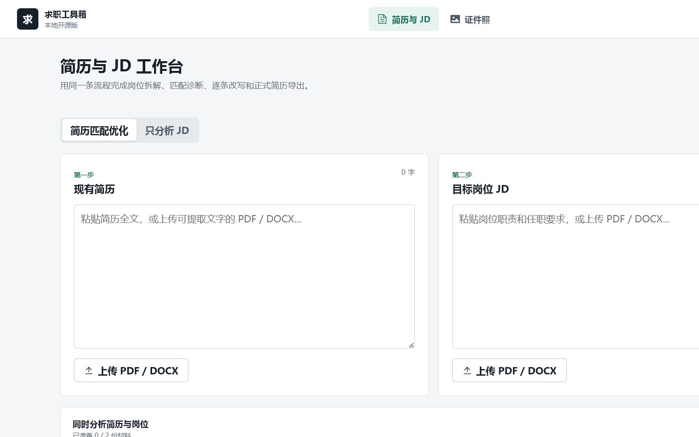
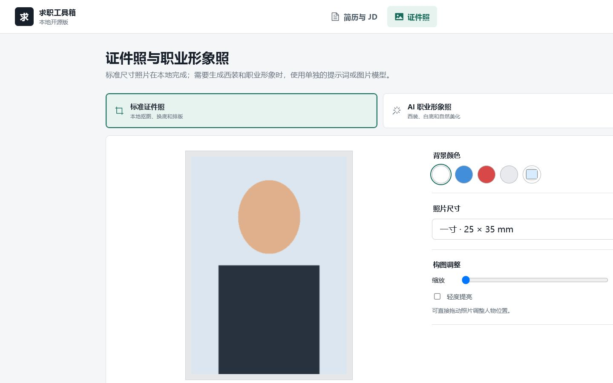
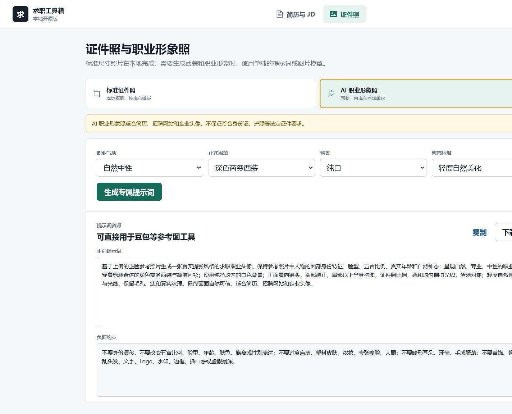

# 求职工具箱

一个在个人电脑本地运行的开源求职工具，把 **简历优化、岗位 JD 分析、ATS 友好模板和证件照** 放进同一条工作流。

使用者提供自己的 API Key，费用由使用者自己的模型账户承担。项目不提供公共服务器，不包含作者的 AI 额度，也不会把 Key 放进浏览器。

## 界面预览



| 本地标准证件照 | AI 职业形象照资源 |
| --- | --- |
|  |  |

## 已实现功能

### 简历与 JD

- 上传 PDF/DOCX 或直接粘贴简历与岗位描述。
- 单独解析 JD，提炼职责、硬技能、软技能、关键词和准备建议。
- 联合分析简历与 JD，输出匹配度、优势证据、能力差距和投递风险。
- 逐条审核 AI 改写，可以采用、忽略或手动编辑。
- 提示词要求不得编造经历、技能和数字；无法确认的事实会标记为需要补充。
- 三套正常简历模板：ATS 标准版、中文校招版、经验求职版。
- 导出可编辑 Word；浏览器打印可保存为文本型 PDF。

### 证件照与职业形象照

- 标准证件照在浏览器本地做人像分割、换底色、裁切、缩放和提亮。
- 支持一寸、二寸、小一寸、考试报名尺寸和六寸相纸排版。
- AI 职业形象照提供身份保持、西装、背景和自然美化提示词资源，可直接用于支持参考图的豆包等工具。
- 配置兼容 OpenAI Image Edit 请求格式的图片接口后，可以在明确同意时直接生成。
- AI 职业形象照适合简历和企业头像，不保证符合身份证、护照等法定证件要求。

## 隐私与安全

- 没有登录、注册、用户数据库或开发者后门页面。
- 简历、JD 和照片默认只在当前请求或浏览器标签页中处理，不保存到项目目录。
- 标准证件照完全在浏览器本地处理。
- 只有点击直接生成并确认同意后，职业照参考图才会发给使用者自己配置的图片模型。
- 后端默认绑定 `127.0.0.1`；上传文件会检查扩展名、MIME、文件签名、大小和文档页数。
- `.env`、虚拟环境、数据库、构建产物和用户输出均被 Git 忽略。

## 环境要求

- Python 3.11+
- Node.js 20+
- 一个使用者自己的 API Key。默认配置适配 DeepSeek 的 OpenAI Chat Completions 兼容接口。
- Docker Desktop 可选。

## Windows 快速启动

```powershell
git clone <你的仓库地址>
cd <项目目录>
Copy-Item .env.example .env
notepad .env
```

至少修改：

```dotenv
AI_API_KEY=使用者自己的 API Key
```

然后双击 `start.bat`。脚本只启动本项目的前后端，不会结束电脑上的其他 Python/Node 进程，也不会删除文件。访问地址为 [http://127.0.0.1:5173](http://127.0.0.1:5173)。

## 手动启动

后端：

```powershell
python -m venv backend\.venv
backend\.venv\Scripts\python.exe -m pip install -r backend\requirements.txt
backend\.venv\Scripts\python.exe -m uvicorn app.main:app --app-dir backend --host 127.0.0.1 --port 8000
```

前端：

```powershell
cd frontend
npm install
npm run dev -- --host 127.0.0.1 --port 5173
```

## Docker

```powershell
Copy-Item .env.example .env
# 编辑 .env 后：
docker compose up --build
```

访问 [http://127.0.0.1:8080](http://127.0.0.1:8080)。

## 模型配置

文本模型使用 OpenAI Chat Completions 兼容参数：

```dotenv
AI_API_KEY=your-ai-api-key
AI_BASE_URL=https://api.deepseek.com/v1
AI_MODEL=deepseek-chat
```

图片模型是可选功能。没有图片 API 时，职业照提示词资源仍然完整可用：

```dotenv
IMAGE_API_KEY=
IMAGE_BASE_URL=
IMAGE_MODEL=
```

不同图片服务的接口格式并不统一。直接生成目前要求接口兼容 `/images/edits` 的 multipart 请求；不兼容时请使用提示词资源模式。

## 测试

```powershell
backend\.venv\Scripts\python.exe -m pip install -r backend\requirements-dev.txt
backend\.venv\Scripts\python.exe -m pytest backend\tests -q

cd frontend
npm test -- --run
npm run build
```

## 项目结构

```text
backend/                 FastAPI、文档解析、AI 编排、Word 导出
frontend/                Vue 工作台、本地证件照画布
docs/superpowers/specs/  已确认的产品与安全设计
docs/superpowers/plans/  实施与验收计划
```

## 贡献

参见 [CONTRIBUTING.md](CONTRIBUTING.md)。提交问题时不要上传真实简历、照片、API Key 或包含个人信息的日志。

## License

[MIT](LICENSE)
