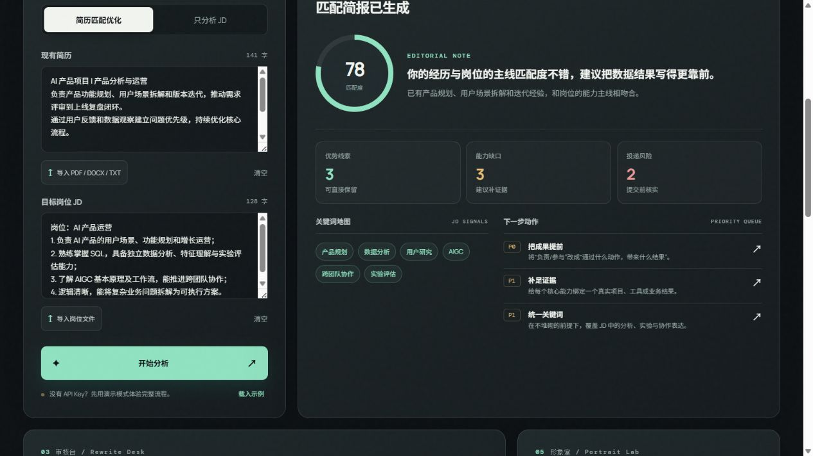
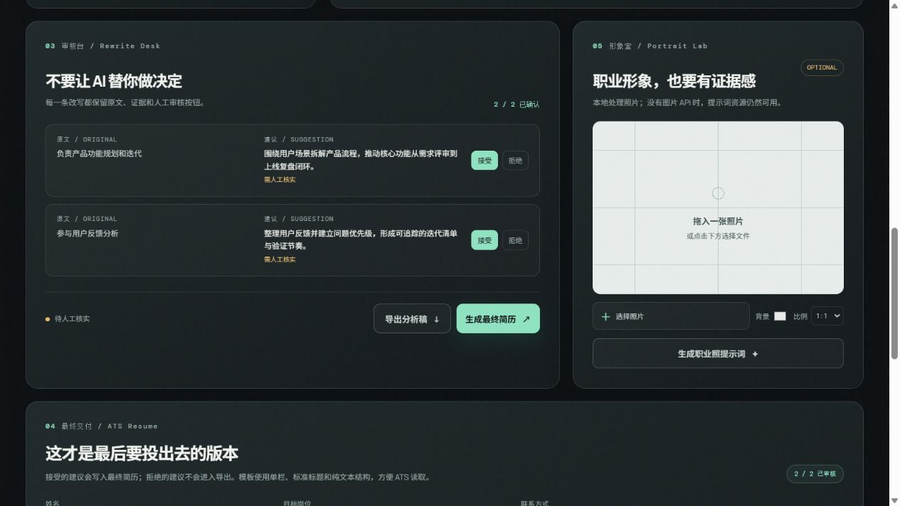
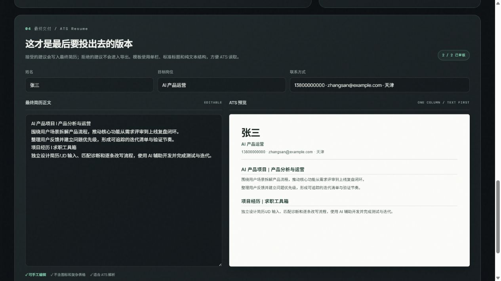

# 求职工坊

> 把经历，编辑成更接近机会的证据。

一个本地优先的简历与岗位分析工作台：从岗位拆解、匹配诊断，到逐条人工审核和 ATS 简历导出，把一次投递准备整理成一条清晰、可复核的流程。



## 它解决什么问题

很多简历工具只能给出一个分数，或者直接生成一份看起来漂亮、却未必真实可用的简历。求职工坊把 AI 放在“分析和建议”的位置，把最终决定留给你：

- 看清岗位真正关注的能力、关键词和证据。
- 了解当前简历的优势、缺口和投递风险。
- 对每一条 AI 改写逐条接受、拒绝或保留原文。
- 把确认后的内容整理成单栏、纯文本优先、适合 ATS 解析的最终版本。

## 一个完整的演示案例

下面以“AI 产品运营”岗位为例：

1. 粘贴现有简历和目标岗位 JD，或导入 PDF、DOCX、TXT 文件。
2. 工具生成匹配度、关键词地图、优势线索、能力缺口、投递风险和下一步动作。
3. 对 AI 给出的改写建议进行人工审核。接受的内容才会进入最终简历，拒绝的内容不会被带入导出文件。
4. 在最终交付区检查姓名、岗位、联系方式和简历正文，然后导出纯文本、Word ATS 或打印为 PDF。

### 1. 岗位匹配与分析

工具会把 JD 转换成可执行的分析简报，而不是只给一个笼统的“匹配/不匹配”结论。


### 2. AI 建议必须经过人工审核

每条建议都会保留原文和建议文本，并显示“接受”“拒绝”操作，避免 AI 把未经核实的内容直接写进简历。



### 3. 生成真正能投递的 ATS 版本

审核完成后，建议会写回简历正文，并同步到单栏 ATS 预览。最终可以导出 Word、纯文本或打印为 PDF。



## 功能一览

### 简历与 JD 工作台

- 简历和岗位描述文本输入、字数统计、草稿自动保存。
- 支持 PDF、DOCX、TXT、MD 文件导入。
- “简历匹配优化”和“只分析 JD”两种模式。

### 匹配诊断

- 匹配度与结论摘要。
- JD 关键词地图。
- 优势线索、能力缺口和投递风险。
- P0/P1 优先级行动建议。

### 审核台

- 原文、建议、证据和审核状态分栏呈现。
- 接受、拒绝和编辑建议。
- 只有确认后的建议才会进入最终简历。

### ATS 最终交付

- 自动识别并整理姓名、目标岗位和联系方式。
- 单栏、标准标题、纯文本优先的简历结构。
- 防止姓名、电话、邮箱重复出现。
- 导出纯文本、Word `.doc`，或使用浏览器打印为 PDF。

### 职业形象工作区

- 本地裁剪、比例调整、背景色和压缩。
- 没有图片 API 时，仍可使用职业照提示词资源。

## 快速开始

需要 Node.js 20 或更高版本：

```powershell
git clone https://github.com/galjay/job-toolkit.git
cd job-toolkit
npm start
```

然后打开：`http://127.0.0.1:5173`

首次打开时，可以直接在页面设置文本 AI 和图片 AI 的 API Key，不需要手动编辑配置文件。没有 API Key 时，也可以先点击“载入示例”体验完整演示流程。

## API 配置

文本接口采用 OpenAI Chat Completions 兼容格式：

- `AI_API_KEY`
- `AI_BASE_URL`，例如 `https://api.deepseek.com/v1`
- `AI_MODEL`，例如 `deepseek-chat`

图片接口是可选项。没有图片 Key 时，仍可使用本地照片处理和提示词资源模式。

## 隐私与安全

- API Key 只由本机页面发送到本机后端，再由后端请求你指定的模型服务商。
- 简历、JD 和配置默认保存在本机，不会自动上传到作者服务器。
- 应用内配置保存在被 `.gitignore` 忽略的 `.runtime-config.json` 中。
- 不要把 `.env`、`.runtime-config.json` 或完整 API Key 提交到 GitHub。

## 项目结构

```text
job-toolkit/
├── public/
│   ├── index.html    # 页面结构
│   ├── styles.css    # 视觉与响应式样式
│   └── app.js        # 前端交互、分析、审核与导出
├── server.mjs        # 本机后端与模型接口代理
├── .env.example      # 配置示例
└── package.json
```

## 项目说明

项目参考了开源求职工具的产品方向，但采用独立的视觉、交互和代码结构重新实现。它更适合在本机使用，数据和模型 Key 的控制权都在使用者手里。

## License

MIT License

